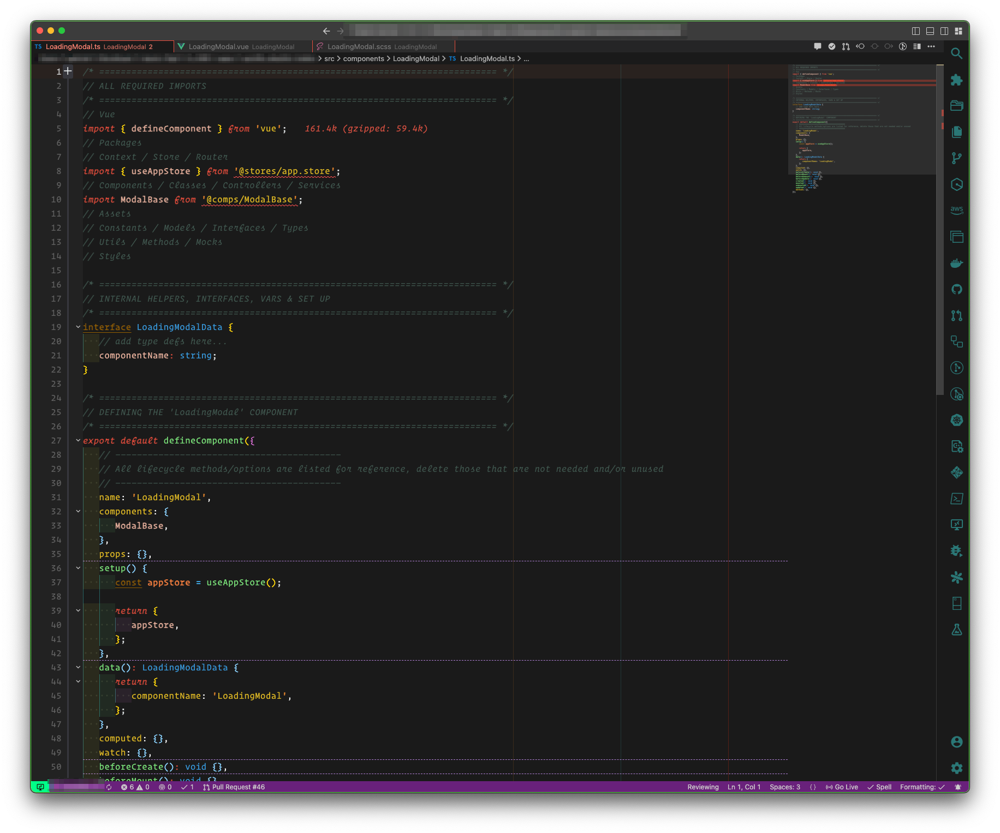
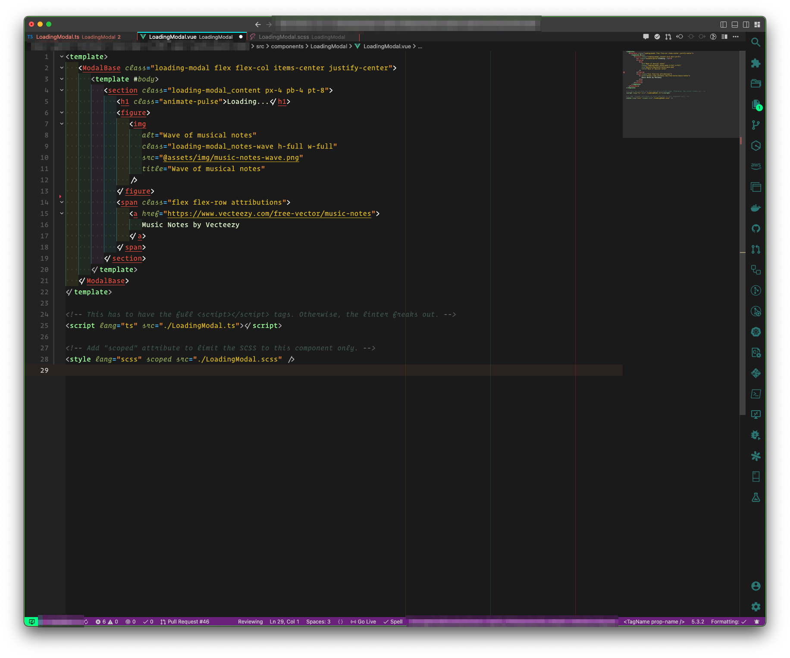

# Day Off VSCode Theme

[GitHub Source](https://github.com/gflujan/bueller-vscode-theme)

This is my take on the popular Brogrammer theme that I first discovered and used in Sublime Text 3.

This is also my first stab at publishing an extension/theme to the VSCode marketplace.
If there's something I'm missing or that could be done better, please let me know. :-)

Hope you enjoy!

_P.S. This theme is created with the use of the "Operator Mono" font in mind._

### Note

The colors you see in the indents are the result of another extension: [Indent Rainbow](https://marketplace.visualstudio.com/items?itemName=oderwat.indent-rainbow).

## Sample Screenshots

